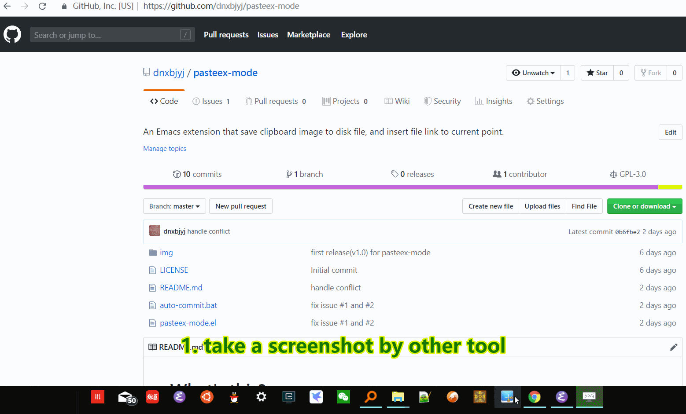

English | [简体中文](./README.zh-CN.md)

# What's this?
It's an GNU Emacs extension, using it you can just use one key to save clipboard image to disk file, and at the same time insert the file link(org-mode/markdown-mode) or file path(other mode) to current point.

Support Windows and Mac, based on PasteEx (on Windows OS) and pngpaste (on Mac OS).

Here is a usage demo:


# Prerequisite
- Windows: Install [PasteEx](https://github.com/huiyadanli/PasteEx/releases)
- Mac: Install [Pngpaste](https://github.com/jcsalterego/pngpaste)

# Installation
Put `pasteex-mode.el` to your `load-path`. The `load-path` is usually `~/elisp/`. It's set in your `~/.emacs` file like this:

```emacs-lisp
(add-to-list 'load-path (expand-file-name "~/elisp"))
(require 'pasteex-mode)
```

# Basic Usage
- Windows: Add `PasteEx.exe` executable to environment PATH, or set the variable `pasteex-executable-path` in your config file, like this:

```emacs-lisp
(setq pasteex-executable-path "/path/to/PasteEx.exe")
```

- Mac：Install pngpaste with Home Brew, and add pngpaste executable to environment PATH, or set the variable `pasteex-macos-executable-path` in your config file, like this:

```emacs-lisp
(setq pasteex-macos-executable-path "/path/to/pngpaste")
```

- Bind your favorite key to function `pasteex-image`, like this:

```emacs-lisp
(global-set-key (kbd "C-x p i") 'pasteex-image)
```

- After you make a screenshot to clipboard, or copy a PNG image file to clipboard, then just press `C-x p i` shortcut, and the file link or path will be inserted to your buffer immediately, the screenshot image file is saved to `./img/` directory by default. If you want to specify another directory name, you can set the value of this variable:

```emacs-lisp
(setq pasteex-image-dir "img/")
```

# Feature List
Support these functions:
- `pasteex-image`: Save clipboard image to disk file, and insert file path to current point.
- `pasteex-delete-img-link-and-file-at-line`: Delete image link at line, and delete related disk file at the same time.
- `pasteex-is-png-file`: Check a file is PNG file or not.

